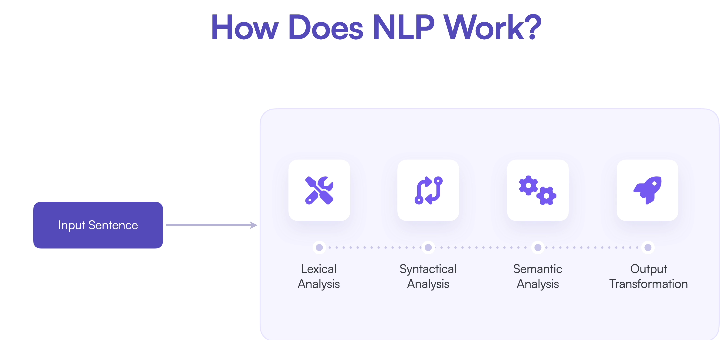
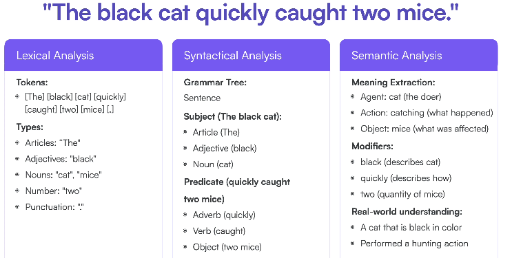
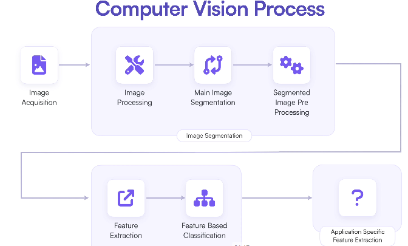
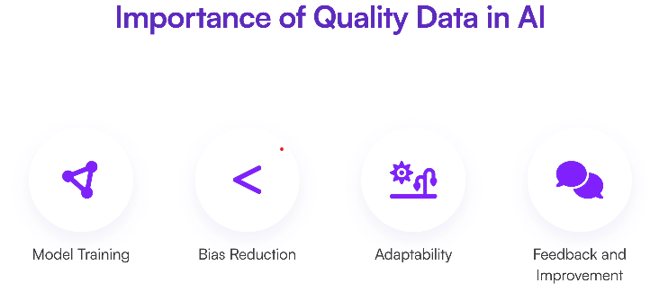
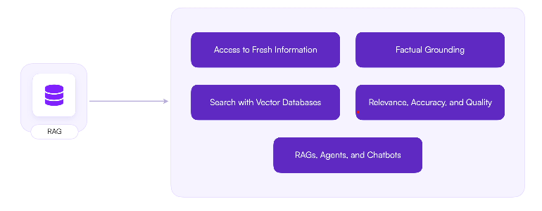

# 🤖 AI Basics

## 📋 Table of Contents
- [Types of AI](#-types)
  - [Natural Language Processing (NLP)](#-nlp)
  - [Computer Vision](#️-computer-vision)
- [Data Quality](#-data-quality)
- [RAG](#-rag-retrieval-augmented-generation)
- [Deep Learning](#-deep-learning)
  - [Neural Networks](#-neural-networks)
  - [CNNs](#️-convolutional-neural-networks-cnn)
- [Practical Implementations](#-practical-implementations)
    - - [Simple Chatbot Implementation Guide](chatbot/README.md)

## 📊 Types:

---

### 🔤 NLP

---

### 👁️ Computer Vision

---

## 📈 Data Quality

---

## 🔍 RAG (Retrieval-Augmented Generation)

• Enhances LLMs with external knowledge retrieval

 

---

## 🧠 Deep Learning
- Uses neural networks with multiple layers
- Enables complex pattern recognition

### 🔄 Neural Networks
- Composed of interconnected neurons
- Learn hierarchical representations

### 🖼️ Convolutional Neural Networks (CNN)
- Specialized for image processing
- Architecture:
  • 🔍 **Convolutional layers:** Extract features
  • 📉 **Pooling layers:** Reduce dimensions
  • 🔗 **Fully connected layers:** Generate predictions

---

## 💻 Practical Implementations

### LLM Chatbot
- [Simple Chatbot Implementation Guide](chatbot/README.md)
