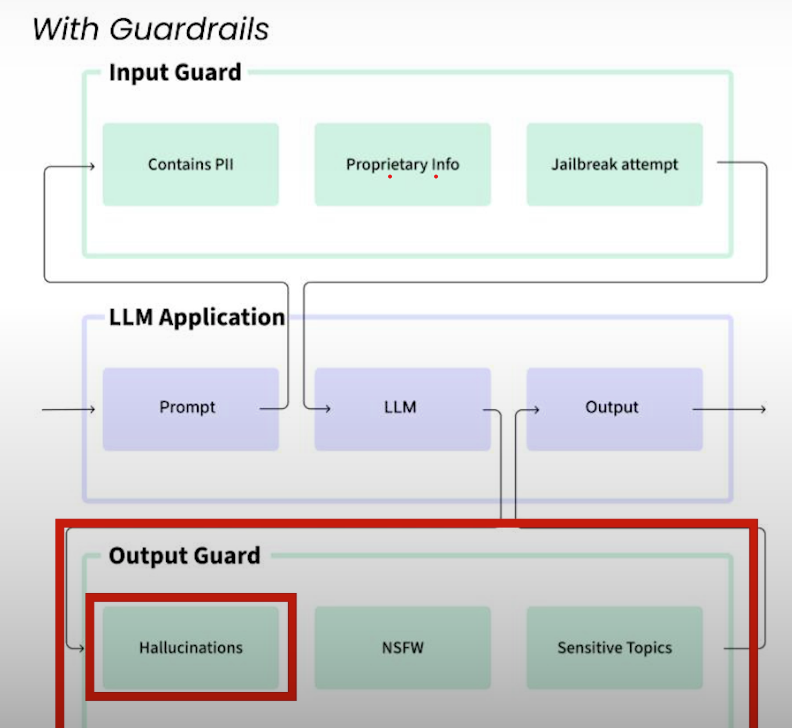
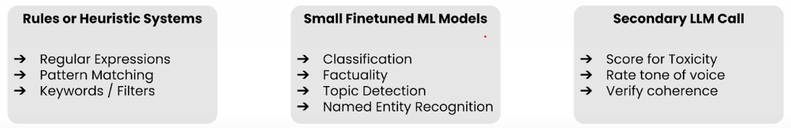

[← Back to Main](../../README.md)

# 🛡️ AI Guardrails

## 🎯 Mitigating Unreliable LLM Behavior
Four key approaches:
- ✨ Better Retrieval → RAG
- 📝 Better Prompting → Prompt Engineering
- 🔄 Better Models → Model Finetuning
- 🚧 Better Guardrails → AI Validation

## 🔍 What Are Guardrails?
Secondary checks or validation around LLM interactions:
- Input/output validation of LLM model
- Ensure behavior matches application context
- Prevent unwanted behaviors

### System Architecture

### Implementation Approaches

## 🛠️ Implementation Examples
- [Server Setup](guardrails_server.md) - Installation and configuration guide
- [Hallucination Detection](hallucinations.md) - Preventing false or unsupported responses
- [PII Protection](pii.md) - Detecting and filtering sensitive information
- [Topic Restrictions](restrict_topic.md) - Limiting conversation scope

---
**Note**: Proper implementation of guardrails is crucial for secure LLM applications.